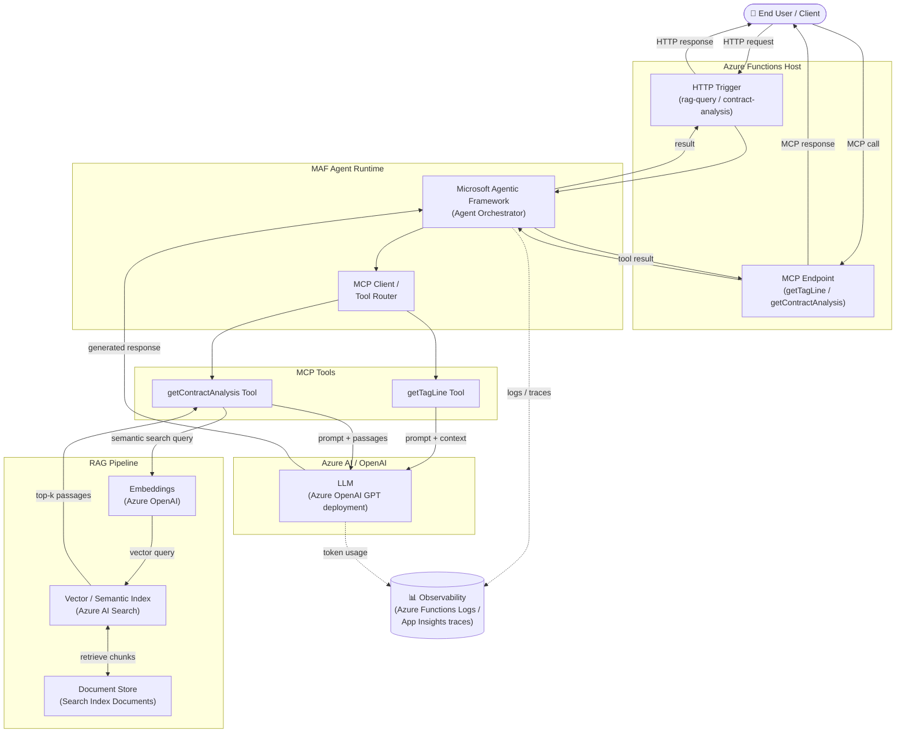

# Azure AI Foundry MAF RAG MCP Agent

Serverless Python Azure Function app that exposes MCP tools and HTTP endpoints powered by the Microsoft Agentic Framework (MAF) and Azure AI Search for retrieval-augmented generation (RAG).

## Architecture

The diagram below shows the end-to-end flow of the MAF RAG MCP Agent: a user request travels through the Azure Functions host to the MAF agent runtime, which dispatches tool calls via the MCP protocol. Tools either invoke the LLM directly or perform retrieval-augmented generation (RAG) against Azure AI Search before calling Azure OpenAI. Telemetry is emitted throughout for observability.



**Legend**

- **MAF** – Microsoft Agentic Framework; the orchestration layer that manages agent lifecycle and tool dispatching.
- **RAG** – Retrieval-Augmented Generation; the pattern of fetching relevant documents from a search index and supplying them as context to the LLM before generation.
- **MCP** – Model Context Protocol; the open protocol used to expose and invoke tools between the agent and its tool servers.

## Features
- **MAF-powered MCP tools**: `getTagLine` and `getContractAnalysis` tools execute through Azure AI Projects/Agentic Framework.
- **HTTP APIs**:
  - `GET /api/rag-query?question=...` showcases RAG over Azure AI Search.
  - `GET /api/contract-analysis?contractName=...` invokes the contract analysis agent via HTTP.
- **Managed identities first**: Uses `DefaultAzureCredential`, so it works with Azure CLI auth locally and Managed Identity in Azure.

## Requirements
- [Python 3.13](https://www.python.org/downloads/)
- [Azure Functions Core Tools v4](https://learn.microsoft.com/azure/azure-functions/functions-run-local#v2)
- [Visual Studio Code](https://code.visualstudio.com/Download)
- VS Code extensions:
  - [Azure Functions](https://marketplace.visualstudio.com/items?itemName=ms-azuretools.vscode-azurefunctions)
  - [Azure Tools](https://marketplace.visualstudio.com/items?itemName=ms-vscode.vscode-node-azure-pack)
  - [Python](https://marketplace.visualstudio.com/items?itemName=ms-python.python)
- [Azure CLI](https://learn.microsoft.com/cli/azure/install-azure-cli) (signed in via `az login` for local development)
- [Node.js 18+](https://nodejs.org/en/download) for MCP Inspector utilities
- Azure subscription with:
  - Azure AI Foundry project (with a GPT-style deployment)
  - Microsoft Agentic Framework enabled
  - Azure AI Search service and index containing contract documents

## Python Dependencies
Packages declared in `requirements.txt`:
- `azure-functions>=1.24.0`
- `azure-ai-projects`
- `azure-identity`
- `agent-framework`
- `azure-search-documents>=11.6.0`

Install locally via:

```pwsh
python -m venv .venv
.venv\Scripts\Activate.ps1
pip install -r requirements.txt
```

## Configuration
Populate `local.settings.json` (local use) or Azure Function App **Configuration** with:
- `AZURE_AI_PROJECT_ENDPOINT` – AI project endpoint URL
- `AZURE_AI_MODEL_DEPLOYMENT_NAME` – deployment ID (e.g. `gpt-4o`)
- `CONTRACT_ANALYSIS_AGENT_ID` – pre-created agent ID for contract analysis
- `AZURE_SEARCH_ENDPOINT` – search service endpoint
- `AZURE_SEARCH_INDEX_NAME` – index name
- `AZURE_SEARCH_SEMANTIC_CONFIG` – semantic config (optional)
- `AZURE_SEARCH_CONTENT_FIELD` – field holding passage text (default `content`)
- `AZURE_SEARCH_TOP_K` – number of passages to fetch (default `3`)

Ensure the executing identity has Data Plane roles:
- `Search Index Data Reader` on the search service
- `AI Developer` (or equivalent) on the AI project

## Local Development

Start the Azure Functions host:

```pwsh
func start
```

Example HTTP calls while running locally:

```pwsh
curl "http://localhost:7071/api/rag-query?question=Summarize%20our%20contract" \
  --header "Content-Type: application/json"

curl "http://localhost:7071/api/contract-analysis?contractName=Contract123"
```

## Deployment

1. Create or reuse a Python Function App on Windows/Linux with Functions v4 and Python 3.10.
2. Configure the environment variables described above.
3. Deploy from this repo:

```pwsh
func azure functionapp publish <YourFunctionAppName> --python
```

If using Azure DevOps or GitHub Actions, run `pip install -r requirements.txt` and then `func azure functionapp publish` (or `az functionapp deployment source config-zip`) in your CI pipeline.

## MCP Inspector

MCP Inspector helps exercise MCP tools locally. Run via `npx` (downloads on demand):

```pwsh
npx @modelcontextprotocol/inspector --endpoint http://localhost:7071/api
```

Select the `getTagLine` or `getContractAnalysis` tool and supply the payload JSON to verify responses.

## Troubleshooting
- **Forbidden / credential errors** – verify `az login` locally or assign the Function App’s managed identity `Search Index Data Reader` and `AI Developer` roles.
- **No documents returned** – confirm the search index field names match the values in `AZURE_SEARCH_CONTENT_FIELD` and that the index is populated.
- **Agent creation failures** – ensure the AI project contains an active MAF deployment and your identity is allowed to create agents.
